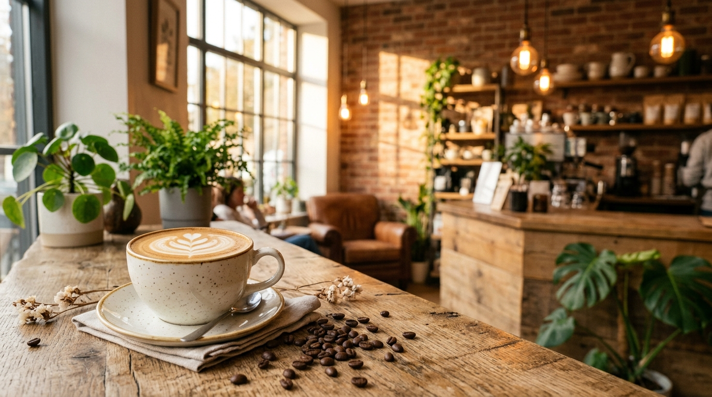

# Kovana Coffee

Selamat datang di repository website **Kovana Coffee**, sebuah coffee shop yang berlokasi di Cikarang Pusat, Bekasi. Website ini dirancang untuk memberikan pengalaman digital yang elegan, modern, dan informatif bagi para pelanggan kami.

## Tentang Kovana Coffee

Kovana Coffee lahir dari kecintaan kami terhadap kopi Nusantara. Kami percaya bahwa kopi yang baik dimulai dari biji yang baik. Berawal dari keinginan sederhana untuk menyajikan kopi berkualitas tinggi, kami memilih langsung biji kopi terbaik, memprosesnya dengan teknik roasting yang presisi, dan menyajikannya dalam suasana yang benar-benar nyaman.

Dengan interior yang *cozy*, ruangan yang nyaman, dan fasilitas lengkap, Kovana Coffee adalah tempat sempurna untuk nongkrong, bekerja, atau sekadar menikmati momen tenang bersama kopi pilihan.

## Fitur Website

- **Landing Page Interaktif**, Memperkenalkan identitas Kovana Coffee dengan desain yang memukau.
- **Menu Digital**, Menampilkan katalog lengkap makanan dan minuman (Coffee, Non-Coffee, Snack, Food).
- **Galeri Foto**, Memperlihatkan suasana interior dan produk-produk kami secara visual.
- **Form Reservasi**, Memudahkan pelanggan untuk melakukan booking tempat yang terintegrasi langsung dengan WhatsApp.

## Teknologi yang Digunakan

Website ini dibangun dengan perpaduan teknologi web modern untuk menjamin performa, aksesibilitas, dan kemudahan pengembangan:

- **Framework:** [Next.js 16](https://nextjs.org/) (App Router)
- **Bahasa:** [TypeScript](https://www.typescriptlang.org/)
- **Styling:** [Tailwind CSS v4](https://tailwindcss.com/)
- **Icons:** [Lucide React](https://lucide.dev/)
- **Fonts:** Playfair Display (Heading) & Inter (Body) via `next/font`

## Lokasi Kami

📍 **Kovana Coffee**
B2 No, Jl. Beruang Raya No.2, Jayamukti, Kec. Cikarang Pusat, Kabupaten Bekasi, Jawa Barat 17550

---

*Website ini dibuat khusus sebagai profil bisnis Kovana Coffee dan dirancang untuk memberikan kenyamanan eksplorasi layaknya pengalaman langsung di kedai kami.*
